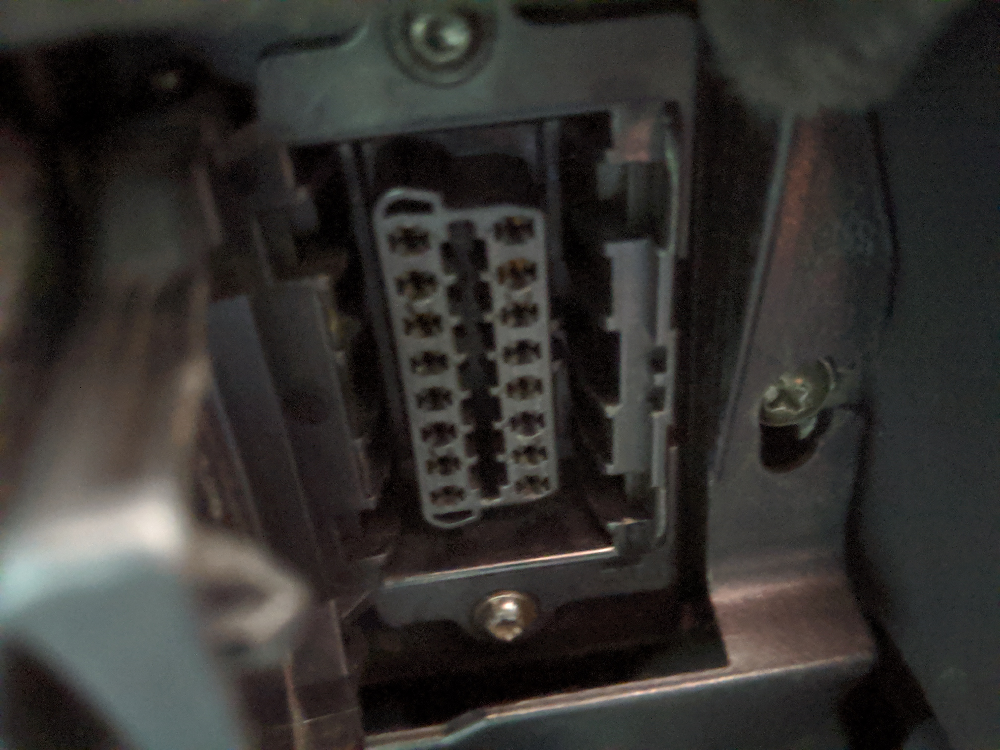
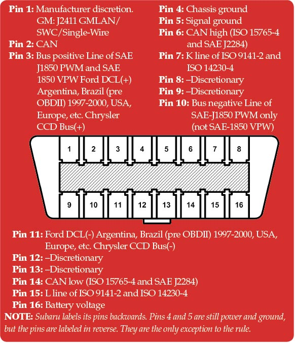
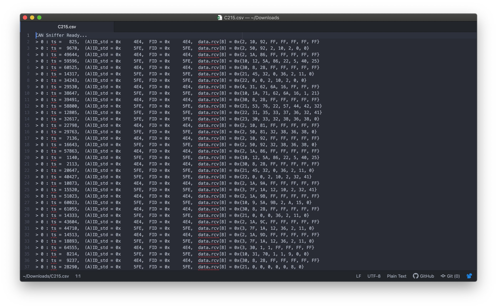
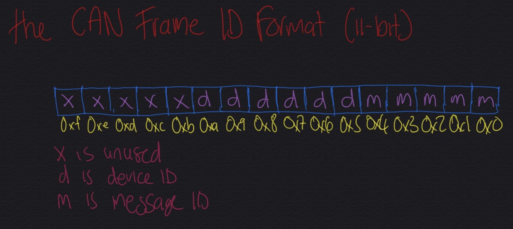

# Chapter 1: Vehicle Bus Protocols and Diagnostics

## Methodology

First you need to work out what you actually have in your car. What type of CAN (there are many). Google is your friend, or by looking at the OBD-II port under the dash

The OBD Standard allows for (five)[https://en.wikipedia.org/wiki/On-board_diagnostics#OBD-II_signal_protocols] signalling protocols. To check which one your car has, look to see which pins are active (you might need a flashlight)

### CAN Frames

Before you sniff traffic, you need to know what you are looking at. Most likely, it will be like so:

Seems hectic right? Well actually not that hectic, if you understand how the frames Network

