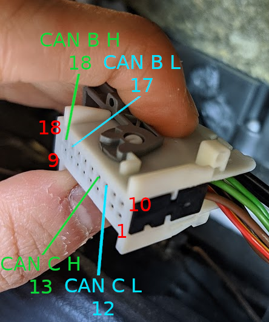
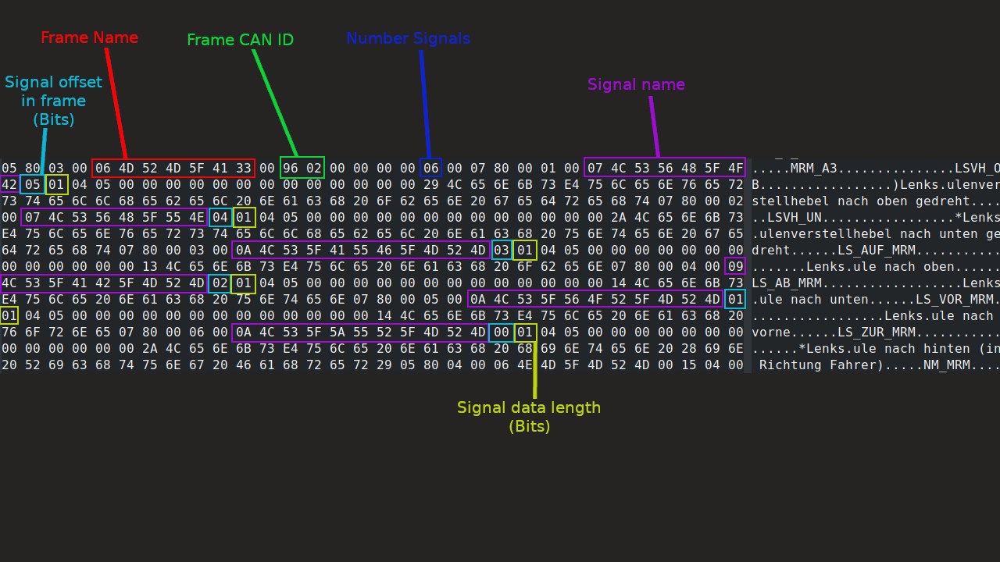

# Chapter 7: In Car Entertainment
This chapter talks about creating a custom car infotainment system for a Merc, using a W203 as an example. The code base here is compatible with the following Merc models:

* W203 (C class 2001-2007)
* W211 (E class 2003-2009)
* W215 (CL class 1998-2006)
* W220 (S class 1998-2005)
* W230 (SL class 2001-2007)

## Videos (How to and showcases)
[Ashcon has a playlist here showing his android based system in his W203](https://www.youtube.com/playlist?list=PLxrw-4Vt7xtstJgl7B1ayPXBFBRulu41J)

## Hardware required
The cars stated above have very simple CAN networks, where there is an Interior CAN network (CAN B 83.3Kbps) for the interior ECU's, and an Engine CAN Network (CAN C 500Kbps) used for the drivetrain ECU's.

It is therefore possible to very simple to connect an Arduino to both busses at the same time:

### Connection points
The connection points listed below are places where 2 wires can be easily connected for Both CAN H/L, in order to tap into canbus directly without any firewall blocking traffic

#### CAN B
* Instrument cluster connector (Pins 17L, 18H)

#### CAN C
* Instrument cluster connector (Pins 12L, 13H)


#### Connection diagrams
##### Instrument cluster


## Hardware list (Ashcon's setup)
* Arduino Uno
* 2x 16Mhz Canbus shields (16Mhz since 8Mhz oscilators do not play well with the 83.3kbps bus speed of interior CAN)
* Android headunit (Pre-rooted with Malysk ROM)
* USB Cable for connecting headunit to arduino

### Code base
* [Arduino code](https://github.com/rnd-ash/MBUX-Port/tree/master/UNO_CODE)
* [Android app code](https://github.com/rnd-ash/MBUX-Port/tree/master/app)


## Code generation for CANBUS interfacing
I (Ashcon) have built a system to convert DAT Files from XSMonitor to actual JVM Class files. XSMonitor was a tool shipped with older versions of DAS that was built for verifying SDConnect via CANBUS emulation. It contains a ton of canbus descriptor files in binary form, that contain the CAN ID of each Frame on the cars canbus network, as well as what each bit does within each frame. To convert the raw data into something that can be interfaced with in code, I built a couple scripts to do the converting.
1. Convert the RAW Dat file to an English translated descriptor file [Source code](https://github.com/rnd-ash/MBUX-Port/blob/master/parse_dat_v3.py)
2. Convert the descriptor file into Kotlin (JVM) source files [Source code](https://github.com/rnd-ash/MBUX-Port/blob/master/db_converter.py)


### Example of XSMonitor conversion
Raw XS Monitor frame content:


Processed Data from parse_dat script (+Translated):
```
FRAME MRM_A3 (0x0296)
		B: LSVH_OB, OFFSET 5 LEN 1 - Steering column adjustment lever turned up
		B: LSVH_UN, OFFSET 4 LEN 1 - Steering column adjustment lever turned down
		B: LS_AUF_MRM, OFFSET 3 LEN 1 - steering column up
		B: LS_AB_MRM, OFFSET 2 LEN 1 - steering column down
		B: LS_VOR_MRM, OFFSET 1 LEN 1 - steering column forward
		B: LS_ZUR_MRM, OFFSET 0 LEN 1 - steering column to the rear (towards the driver)
```

Kotlin class generated by db_converter.py:
```kotlin
@file:Suppress("unused", "FunctionName", "ClassName")
package com.rndash.mbheadunit.nativeCan.canB
import com.rndash.mbheadunit.CanFrame // AUTO GEN
import com.rndash.mbheadunit.nativeCan.CanBusNative // AUTO GEN

/**
 *   Generated by db_converter.py
 *   Object for MRM_A3 (ID 0x0296)
**/

object MRM_A3 {

    /**
     *  Returns the most recent Can Frame representing the state
     *  of MRM_A3
    **/
    fun get_frame() : CanFrame? = CanBusNative.getBFrame(CanBAddrs.MRM_A3)

	/** Gets Steering column adjustment lever turned up **/
	fun get_lsvh_ob() : Boolean = CanBusNative.getECUParameterB(CanBAddrs.MRM_A3, 5, 1) != 0

	/** Sets Steering column adjustment lever turned up **/
	fun set_lsvh_ob(f: CanFrame, p: Boolean) {
		checkFrame(f)
		CanBusNative.setFrameParameter(f, 5, 1, if(p) 1 else 0)
	}

	/** Gets Steering column adjustment lever turned down **/
	fun get_lsvh_un() : Boolean = CanBusNative.getECUParameterB(CanBAddrs.MRM_A3, 4, 1) != 0

	/** Sets Steering column adjustment lever turned down **/
	fun set_lsvh_un(f: CanFrame, p: Boolean) {
		checkFrame(f)
		CanBusNative.setFrameParameter(f, 4, 1, if(p) 1 else 0)
	}

	/** Gets steering column up **/
	fun get_ls_auf_mrm() : Boolean = CanBusNative.getECUParameterB(CanBAddrs.MRM_A3, 3, 1) != 0

	/** Sets steering column up **/
	fun set_ls_auf_mrm(f: CanFrame, p: Boolean) {
		checkFrame(f)
		CanBusNative.setFrameParameter(f, 3, 1, if(p) 1 else 0)
	}

	/** Gets steering column down **/
	fun get_ls_ab_mrm() : Boolean = CanBusNative.getECUParameterB(CanBAddrs.MRM_A3, 2, 1) != 0

	/** Sets steering column down **/
	fun set_ls_ab_mrm(f: CanFrame, p: Boolean) {
		checkFrame(f)
		CanBusNative.setFrameParameter(f, 2, 1, if(p) 1 else 0)
	}

	/** Gets steering column forward **/
	fun get_ls_vor_mrm() : Boolean = CanBusNative.getECUParameterB(CanBAddrs.MRM_A3, 1, 1) != 0

	/** Sets steering column forward **/
	fun set_ls_vor_mrm(f: CanFrame, p: Boolean) {
		checkFrame(f)
		CanBusNative.setFrameParameter(f, 1, 1, if(p) 1 else 0)
	}

	/** Gets steering column to the rear (towards the driver) **/
	fun get_ls_zur_mrm() : Boolean = CanBusNative.getECUParameterB(CanBAddrs.MRM_A3, 0, 1) != 0

	/** Sets steering column to the rear (towards the driver) **/
	fun set_ls_zur_mrm(f: CanFrame, p: Boolean) {
		checkFrame(f)
		CanBusNative.setFrameParameter(f, 0, 1, if(p) 1 else 0)
	}

	/**
     * Auto generated function
     * Throws exception if user tries to set a value in a frame
     * Not designated from the correct ECU
    **/
    private fun checkFrame(f: CanFrame) {
        if (f.canID != CanBAddrs.MRM_A3.addr) {
            throw IllegalArgumentException("CAN ID does not match object!")
        }
    }

	override fun toString() = """
		|Frame MRM_A3 (0x0296):
		|	Steering column adjustment lever turned up: ${get_lsvh_ob()}
		|	Steering column adjustment lever turned down: ${get_lsvh_un()}
		|	steering column up: ${get_ls_auf_mrm()}
		|	steering column down: ${get_ls_ab_mrm()}
		|	steering column forward: ${get_ls_vor_mrm()}
		|	steering column to the rear (towards the driver): ${get_ls_zur_mrm()}
	""".trimMargin("|")
}
```
